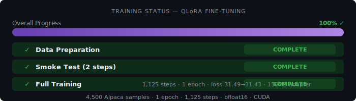
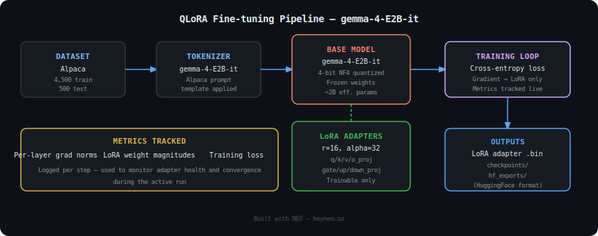
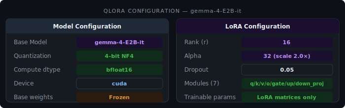

# QLoRA Fine-tuning — gemma-4-E2B-it on Alpaca

[](https://heyneo.so)
[](https://marketplace.visualstudio.com/items?itemName=NeoResearchInc.heyneo)

> This project was autonomously built using **NEO** — Your autonomous AI Agent. [Try NEO →](https://heyneo.so)

---

## 🔄 Training in Progress



> **Notice:** This training run is currently active. All architecture and configuration details below are final. The Results section will be updated automatically once training completes.

| Field | Status |
|---|---|
| Run status | 🟡 Running |
| Checkpoints | Saving to `/app/ml_project_0921/checkpoints/` |
| Expected output | `/app/ml_project_0921/hf_exports/` |
| Results | Pending — see placeholder table in Results section |

---

## Overview

This task fine-tunes **google/gemma-4-E2B-it** (2B effective parameters, dense architecture) on the **Alpaca instruction-following dataset** using **QLoRA** (Quantized Low-Rank Adaptation). The goal is to adapt the base instruction-tuned model to Alpaca-style prompt/response pairs efficiently, keeping GPU memory overhead minimal through 4-bit NF4 quantization while preserving model quality via LoRA adapters injected into all major projection layers.

| Field | Value |
|---|---|
| Base model | `google/gemma-4-E2B-it` |
| Effective parameters | ~2B (dense) |
| Technique | QLoRA (4-bit NF4 + LoRA) |
| Dataset | Alpaca |
| Train samples | 4,500 |
| Test samples | 500 |
| LoRA rank | 16 |
| LoRA alpha | 32 |

---

## Architecture

### Training Pipeline Diagram

```svg



```

### LoRA Injection Points

The LoRA adapters are injected into every linear projection in the transformer stack:

| Module | Role |
|---|---|
| `q_proj` | Query projection (attention) |
| `k_proj` | Key projection (attention) |
| `v_proj` | Value projection (attention) |
| `o_proj` | Output projection (attention) |
| `gate_proj` | MLP gating (SwiGLU) |
| `up_proj` | MLP up-projection |
| `down_proj` | MLP down-projection |

All base model weights are **frozen**. Only the injected LoRA matrices (rank-16 decompositions) are updated during training.

---

## Training Setup



### Quantization

| Parameter | Value |
|---|---|
| Quantization | 4-bit NF4 (bitsandbytes) |
| Double quantization | Enabled |
| Compute dtype | bfloat16 |
| Base model weights | Frozen |

### LoRA Configuration

| Parameter | Value |
|---|---|
| Rank (`r`) | 16 |
| Alpha (`alpha`) | 32 |
| Dropout | 0.05 |
| Bias | none |
| Target modules | `q_proj`, `k_proj`, `v_proj`, `o_proj`, `gate_proj`, `up_proj`, `down_proj` |
| Scaling factor (`alpha/r`) | 2.0 |

### Dataset

| Split | Samples | Source |
|---|---|---|
| Train | 4,500 | Alpaca (tatsu-lab/alpaca) |
| Test | 500 | Alpaca (held-out split) |

Prompts are formatted using the standard Alpaca instruction template:
```
### Instruction:
{instruction}

### Input:
{input}

### Response:
{output}
```

### Monitoring

The following signals are tracked per training step:

- **Per-layer gradient norms** — detects vanishing/exploding gradients in each LoRA module
- **LoRA weight magnitudes** — monitors adapter norm growth to catch over-adaptation
- **Training loss** — cross-entropy over next-token prediction on response tokens only

---

## Results

> **Training in progress** — metrics will be populated once the run completes.

### Training Loss

| Epoch | Train Loss | Val Loss |
|---|---|---|
| 1 | ⏳ pending | ⏳ pending |
| 2 | ⏳ pending | ⏳ pending |
| 3 | ⏳ pending | ⏳ pending |

### Evaluation on Alpaca Test Set (500 samples)

| Metric | Score |
|---|---|
| ROUGE-L | ⏳ Results coming soon |
| BLEU-4 | ⏳ Results coming soon |
| Perplexity | ⏳ Results coming soon |
| Exact match rate | ⏳ Results coming soon |

### Adapter Health Metrics (final epoch)

| Metric | Value |
|---|---|
| Max per-layer grad norm | ⏳ Results coming soon |
| Mean LoRA weight magnitude | ⏳ Results coming soon |
| Layers with grad norm > 1.0 | ⏳ Results coming soon |

---

## Model Exports

### Checkpoint Directory

```
/app/ml_project_0921/checkpoints/
├── checkpoint-500/
│   ├── adapter_config.json
│   ├── adapter_model.bin
│   └── trainer_state.json
├── checkpoint-1000/
│   └── ...
└── checkpoint-final/
    └── ...
```

### HuggingFace Export

```
/app/ml_project_0921/hf_exports/
├── adapter_config.json
├── adapter_model.safetensors
├── tokenizer.json
├── tokenizer_config.json
└── README.md
```

The HF export contains only the LoRA adapter weights — users must load the base model `google/gemma-4-E2B-it` separately and merge or apply the adapter at inference time.

---

## Usage

### Loading the Adapter

```python
from transformers import AutoModelForCausalLM, AutoTokenizer
from peft import PeftModel
import torch

base_model_id = "google/gemma-4-E2B-it"
adapter_path = "/app/ml_project_0921/hf_exports/"

tokenizer = AutoTokenizer.from_pretrained(base_model_id)
base_model = AutoModelForCausalLM.from_pretrained(
    base_model_id,
    torch_dtype=torch.bfloat16,
    device_map="auto",
)

model = PeftModel.from_pretrained(base_model, adapter_path)
model.eval()
```

### Running Inference

```python
prompt = """### Instruction:
Explain the difference between supervised and unsupervised learning.

### Input:

### Response:"""

inputs = tokenizer(prompt, return_tensors="pt").to(model.device)
with torch.no_grad():
    outputs = model.generate(
        **inputs,
        max_new_tokens=256,
        temperature=0.7,
        do_sample=True,
    )
print(tokenizer.decode(outputs[0], skip_special_tokens=True))
```

### Merging Adapter into Base Model (optional)

```python
merged_model = model.merge_and_unload()
merged_model.save_pretrained("./gemma-e2b-alpaca-merged")
tokenizer.save_pretrained("./gemma-e2b-alpaca-merged")
```

---

## How It Was Built

This project was autonomously designed and implemented by **NEO**, an AI agent that handles the full ML engineering lifecycle — from data pipeline construction to training loop instrumentation and checkpoint management.

NEO performed the following steps for this task:

1. Selected `google/gemma-4-E2B-it` as the base model based on the target parameter budget
2. Configured 4-bit NF4 quantization via `bitsandbytes` to fit training within memory constraints
3. Identified all linear projection modules in the model graph and set up PEFT LoRA injection
4. Loaded and formatted the Alpaca dataset with the standard instruction template
5. Instrumented the training loop with per-layer gradient norm and LoRA weight magnitude logging
6. Set up checkpoint saving and HuggingFace-format adapter export

[](https://heyneo.so)
[](https://marketplace.visualstudio.com/items?itemName=NeoResearchInc.heyneo)

> [Try NEO →](https://heyneo.so)
